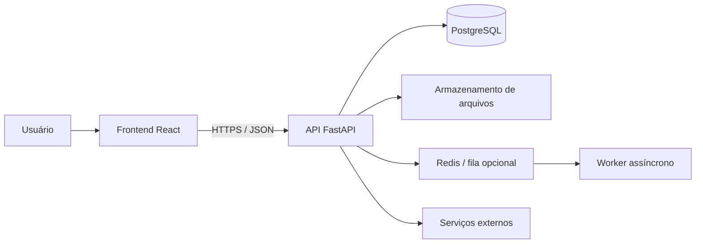

# 2. Arquitetura técnica

## 2.1 Visão geral



O frontend nunca acessará diretamente as tabelas de produção. Toda operação passará pela API, que aplicará autenticação, autorização, validações, transações e auditoria.

## 2.2 Stack proposta

| Camada | Tecnologia | Motivo |
|---|---|---|
| Frontend | React, TypeScript, Vite | Mantém a base do projeto original e do Ilya. |
| Interface | Tailwind CSS, shadcn/ui, Lucide | Consistência visual e componentes acessíveis. |
| Estado remoto | TanStack React Query | Cache, loading, invalidação e tratamento de falhas. |
| Formulários | React Hook Form + Zod | Validação previsível no cliente, sem substituir o backend. |
| Backend | FastAPI + Pydantic v2 | API tipada, documentação OpenAPI e boa separação de schemas. |
| Persistência | SQLAlchemy 2 | Repositórios e transações explícitas. |
| Migrations | Alembic | Evolução versionada do schema. |
| Banco | PostgreSQL 16 | Integridade relacional, locks, índices e consultas de agenda. |
| Arquivos | S3 compatível em produção | Fotos de vistoria, contratos e recibos fora do container. |
| Jobs | Celery + Redis, quando necessário | PDFs pesados, notificações e processamento de imagens. |
| Desenvolvimento | Docker Compose | Ambiente reproduzível. |
| Testes | Pytest, Vitest, Testing Library, Playwright | Cobertura por camada e fluxos completos. |

## 2.3 Estilo arquitetural

Será usado um **monólito modular**. É mais simples para o estágio atual que microsserviços, mas preserva limites claros entre módulos.

Cada módulo do backend terá:

- router HTTP;
- schemas de entrada e saída;
- serviço de regras de negócio;
- repositório de persistência;
- modelo SQLAlchemy;
- testes unitários e de integração.

Dependências entre módulos devem passar pelos serviços, não por consultas improvisadas entre routers.

## 2.4 Estrutura planejada do repositório futuro

Esta árvore é uma especificação, não uma estrutura já implementada:

```text
AssisCarretas/
├── backend/
│   ├── app/
│   │   ├── api/v1/routers/
│   │   ├── core/
│   │   ├── models/
│   │   ├── schemas/
│   │   ├── repositories/
│   │   ├── services/
│   │   ├── jobs/
│   │   ├── integrations/
│   │   └── tests/
│   ├── alembic/
│   └── scripts/
├── frontend/
│   ├── src/
│   │   ├── api/
│   │   ├── components/
│   │   ├── features/
│   │   ├── hooks/
│   │   ├── layouts/
│   │   ├── pages/
│   │   ├── routes/
│   │   ├── schemas/
│   │   ├── types/
│   │   └── tests/
│   └── public/
├── infra/
│   ├── docker/
│   └── scripts/
├── docs/
├── docker-compose.yml
└── .env.example
```

## 2.5 Princípios obrigatórios

- O backend é a fonte da verdade para preços, disponibilidade e transições de status.
- Valores monetários usam `NUMERIC/Decimal`, nunca ponto flutuante.
- Datas são armazenadas em UTC e exibidas no fuso configurado da operação.
- Exclusão física de registros históricos é evitada; usar arquivamento/inativação.
- Toda alteração crítica registra usuário, data, ação e contexto.
- CPF, CNH e telefone não aparecem integralmente em logs.
- Uploads são validados por tipo real, tamanho e autorização.
- Toda listagem possui paginação, filtros e limites máximos.
- API versionada sob `/api/v1`.
- Erros seguem formato único com código, mensagem segura e identificador de correlação.

## 2.6 Processamento assíncrono

O MVP pode gerar documentos pequenos de modo síncrono. A fila será introduzida quando houver envio de notificações, processamento de muitas fotos ou relatórios pesados.

Fluxo padrão futuro:

1. API cria um job `PENDING`.
2. API retorna `202 Accepted` e o identificador.
3. Worker muda para `PROCESSING`.
4. Worker conclui como `COMPLETED` ou `FAILED`.
5. Retentativas usam backoff e idempotência.
6. Falhas definitivas vão para fila de análise.

## 2.7 Ambientes

| Ambiente | Finalidade | Dados |
|---|---|---|
| Local | Desenvolvimento individual | Seeds fictícios. |
| Homologação | Testes integrados e aceite | Dados sintéticos, nunca cópia livre de produção. |
| Produção | Operação real | Backups, criptografia, auditoria e acesso restrito. |

