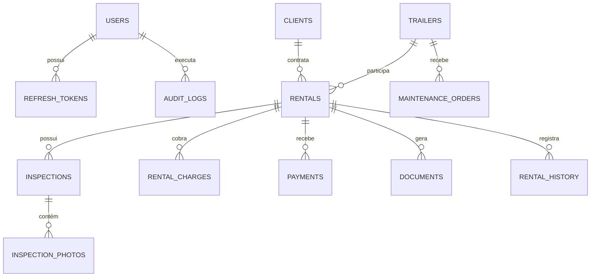

# 3. Planejamento do banco de dados

## 3.1 Diretrizes

- PostgreSQL 16 como banco principal.
- UUID como chave primária externa.
- `created_at`, `updated_at` e, quando aplicável, `deleted_at`/`archived_at`.
- Migrations Alembic obrigatórias em todos os ambientes.
- Restrições, índices e chaves estrangeiras complementam a validação da aplicação.
- Histórico operacional nunca deve desaparecer por exclusão em cascata de cliente ou carreta.
- CPF e CNH armazenados normalizados; exibição mascarada conforme permissão.

## 3.2 Mapa de relacionamentos

## 3.3 Entidades essenciais do MVP

### `users`

- `id`, `name`, `email` único, `hashed_password`;
- `role`: `ADMIN`, `GESTOR`, `ATENDENTE`, `VISTORIADOR`, `VIEWER`;
- `is_active`, `must_change_password`;
- `last_login_at`, timestamps.

### `refresh_tokens`

- `id`, `user_id`, hash do token, expiração, revogação;
- dados mínimos de sessão e timestamps;
- exclusão em cascata permitida apenas quando a conta é removida de forma controlada.

### `clients`

- `id`, `full_name`, `cpf` único, `birth_date`;
- `cnh_number`, `cnh_category`, `cnh_expires_at`;
- `phone`, `email` opcional;
- endereço separado em CEP, logradouro, número, complemento, bairro, cidade e UF;
- `notes` restritas, `is_active`, timestamps.

Regras: maior de 18 anos; CPF válido; CNH não vencida para retirada quando exigido; cliente inativo não inicia nova locação.

### `trailers`

- `id`, `code` único, `model`, `description`;
- `plate`/identificador legal quando aplicável, `renavam` opcional;
- dimensões: comprimento, largura e altura;
- `load_capacity_kg`;
- `daily_rate`, `hourly_rate` opcional, `deposit_amount` opcional;
- `status`: `AVAILABLE`, `RESERVED`, `RENTED`, `MAINTENANCE`, `INACTIVE`;
- `is_active`, timestamps.

O status resume o estado operacional, mas a disponibilidade real sempre considera conflitos de período em locações e manutenções.

### `rentals`

- `id`, `code` sequencial único;
- `client_id`, `trailer_id`;
- `created_by_user_id` e responsáveis por retirada/devolução;
- `start_at`, `expected_return_at`, `actual_return_at`;
- `period_type`, `period_quantity` apenas como memória comercial;
- snapshots de preço: diária/hora, desconto, caução e total previsto;
- total final e observações;
- `status`: `DRAFT`, `RESERVED`, `ACTIVE`, `OVERDUE`, `COMPLETED`, `CANCELLED`;
- motivo de cancelamento e timestamps.

O preço acordado é copiado para a locação. Alterar a tarifa da carreta depois não altera contratos anteriores.

### `inspections`

- `id`, `rental_id`, `type`: `PICKUP` ou `RETURN`;
- quilometragem não é obrigatória para carreta, mas pode existir como campo opcional;
- checklist estrutural, pneus, iluminação, engate, documentação e limpeza;
- observações, assinatura/nome do responsável;
- `performed_by_user_id`, `performed_at`.

Restrição única recomendada por locação e tipo, salvo regra explícita de revisão versionada.

### `inspection_photos`

- `id`, `inspection_id`, chave do arquivo, nome original seguro;
- tipo MIME verificado, tamanho, hash e categoria da foto;
- timestamps.

Arquivos não ficam gravados como Base64 no banco.

### `maintenance_orders`

- `id`, `trailer_id`, tipo, descrição, prioridade;
- `starts_at`, `expected_end_at`, `completed_at`;
- custo estimado/final;
- `status`: `OPEN`, `IN_PROGRESS`, `COMPLETED`, `CANCELLED`;
- criador e responsável.

Manutenção aberta ou sobreposta ao período bloqueia novas reservas.

### `rental_history`

- `id`, `rental_id`, `user_id`;
- ação, status anterior/novo, detalhes estruturados e data.

### `audit_logs`

- ator, ação, entidade, identificador, resultado, IP reduzido/adequado e correlação;
- nunca registrar senha, token, CPF/CNH completos ou conteúdo integral de documentos.

## 3.4 Entidades previstas para evolução

### `rental_charges`

Diária/hora, atraso, avaria, limpeza, desconto, caução ou ajuste. Mantém origem, quantidade, valor unitário e total.

### `payments`

Método, valor, status, referência externa, vencimento, pagamento, estorno e idempotency key.

### `documents`

Contrato, termo de vistoria e recibo; versão, hash, localização, geração e assinatura.

### `branches`

Filiais/unidades, caso a empresa passe a operar múltiplos pátios. Nesse momento, carretas, usuários e locações ganham escopo por unidade.

### `jobs`

Rastreamento de tarefas assíncronas com status, progresso, tentativas e erro seguro.

## 3.5 Regras de integridade

- Não permitir duas locações `RESERVED`/`ACTIVE` sobrepostas para a mesma carreta.
- Criar reserva e bloquear agenda na mesma transação.
- Ativação exige carreta disponível, cliente apto e vistoria de retirada concluída conforme política.
- Finalização exige vistoria de devolução ou justificativa autorizada.
- Carreta em locação ativa não pode ser excluída nem enviada manualmente para disponível.
- Cliente, carreta ou usuário com histórico deve ser inativado, não apagado.
- Valores totais são recalculados pelo backend a partir dos componentes autorizados.
- Transições de status usam controle de concorrência para impedir duas operações simultâneas.

## 3.6 Índices principais

- `clients(cpf)` único e `clients(full_name)` para busca.
- `trailers(code)` e `trailers(plate)` únicos quando preenchidos.
- `trailers(status, is_active)`.
- `rentals(trailer_id, start_at, expected_return_at, status)`.
- `rentals(client_id, created_at)`.
- `rentals(code)` único.
- `maintenance_orders(trailer_id, starts_at, expected_end_at, status)`.
- `audit_logs(entity_type, entity_id, created_at)`.

## 3.7 Migração do protótipo

1. Exportar `carretas`, `clientes`, `alugueis` e `vistorias` do Supabase.
2. Congelar um dicionário de mapeamento de status e campos.
3. Limpar CPF, telefone, datas e números decimais.
4. Importar primeiro clientes e carretas.
5. Importar locações preservando IDs ou uma tabela de equivalência.
6. Importar vistorias e resolver fotos existentes.
7. Recalcular apenas campos derivados que não representem preço histórico.
8. Comparar contagens, somas financeiras e amostras antes de aceitar a migração.

