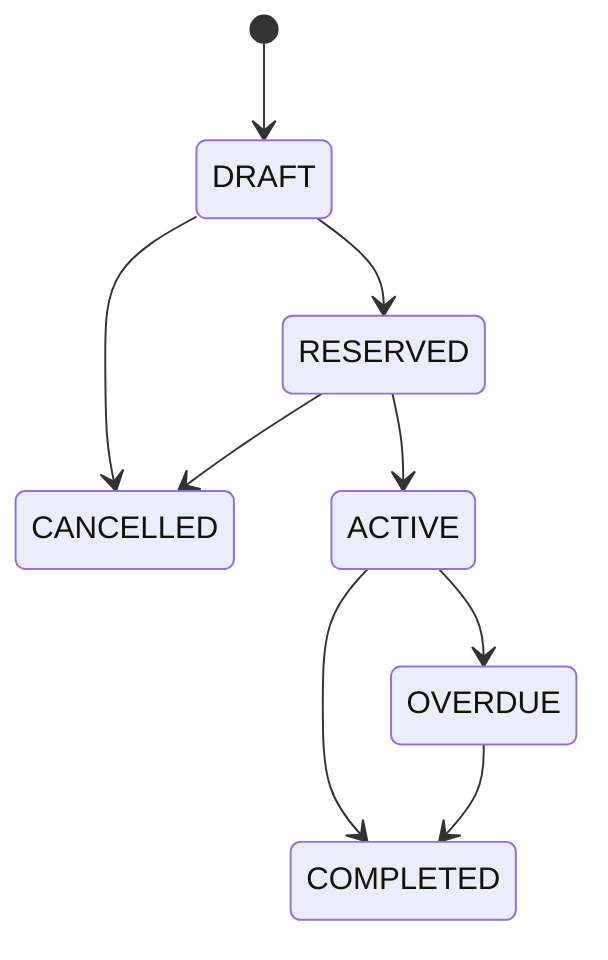

# 4. Módulos, regras de negócio e API planejada

## 4.1 Módulos funcionais

### Autenticação e usuários

- Login, renovação e encerramento de sessão.
- Consulta do usuário atual.
- Administração de usuários, papéis, ativação e troca obrigatória de senha.

### Dashboard

- Totais por status.
- Locações ativas e atrasadas.
- Retiradas e devoluções próximas.
- Carretas em manutenção.
- Receita agregada somente para perfis autorizados.

### Clientes

- Busca paginada por nome/CPF mascarado.
- Cadastro, edição, inativação e reativação.
- Consulta do histórico de locações conforme permissão.
- Validação de idade, CPF, CNH e vencimento.

### Carretas

- Cadastro técnico, tarifa, situação e documentos.
- Consulta de disponibilidade por intervalo.
- Inativação e histórico de locação/manutenção.
- Status não deve ser editado livremente quando derivado de uma operação.

### Locações

- Rascunho/reserva, confirmação, retirada, prorrogação, devolução, cancelamento.
- Cálculo e snapshot de preço no servidor.
- Prevenção de conflito de agenda.
- Cadastro rápido de cliente mantendo as mesmas validações do cadastro completo.

### Vistorias

- Checklist de retirada e devolução.
- Upload de fotos por categoria.
- Registro de avarias e comparação entre as duas vistorias.
- Assinatura prevista como evolução.

### Manutenção

- Abertura, início, conclusão e cancelamento de ordem.
- Bloqueio de agenda.
- Histórico e custos.

### Documentos e relatórios

- Contrato, termo de retirada/devolução e recibo em PDF.
- Relatórios operacionais e financeiros sujeitos a RBAC.

## 4.2 Regras centrais

### Disponibilidade

Uma carreta está disponível para um intervalo quando:

- está ativa;
- não está em manutenção/inativa;
- não possui locação `RESERVED`, `ACTIVE` ou `OVERDUE` sobreposta;
- não possui manutenção aberta planejada sobreposta.

O simples valor `status = AVAILABLE` não basta.

### Preço

- Dias: tarifa diária × quantidade, conforme política de arredondamento definida.
- Horas: usar tarifa horária própria; dividir diária por 24 somente se a empresa aprovar formalmente essa regra.
- Atrasos e avarias entram como cobranças separadas.
- Descontos exigem limite por papel e justificativa acima do limite.
- O frontend exibe estimativa; o backend devolve o valor oficial.

### Estados da locação

Transições fora desse fluxo são rejeitadas. Reabertura ou correção administrativa precisa de permissão elevada e auditoria.

### Retirada

- Confirmar identidade e habilitação.
- Confirmar disponibilidade ainda dentro da transação.
- Registrar vistoria de retirada.
- Registrar responsável e horário.
- Alterar locação para `ACTIVE` e carreta para `RENTED` de modo atômico.

### Devolução

- Registrar horário real.
- Realizar vistoria de devolução.
- Calcular atraso e cobranças adicionais.
- Finalizar financeiro conforme escopo da fase.
- Alterar carreta para `AVAILABLE` ou `MAINTENANCE` conforme avarias.

## 4.3 Rotas propostas

Prefixo: `/api/v1`.

### Sistema e autenticação

- `GET /health`
- `POST /auth/login`
- `POST /auth/refresh`
- `POST /auth/logout`
- `GET /auth/me`

### Usuários

- `GET /users`
- `POST /users`
- `GET /users/{id}`
- `PATCH /users/{id}`
- `POST /users/{id}/activate`
- `POST /users/{id}/deactivate`

### Clientes

- `GET /clients`
- `POST /clients`
- `GET /clients/{id}`
- `PATCH /clients/{id}`
- `POST /clients/{id}/deactivate`
- `GET /clients/{id}/rentals`

### Carretas

- `GET /trailers`
- `POST /trailers`
- `GET /trailers/{id}`
- `PATCH /trailers/{id}`
- `POST /trailers/{id}/deactivate`
- `GET /trailers/{id}/availability?start_at=&end_at=`
- `GET /trailers/{id}/history`

### Locações

- `GET /rentals`
- `POST /rentals/quote` — estimativa oficial sem persistir.
- `POST /rentals` — cria rascunho/reserva.
- `GET /rentals/{id}`
- `PATCH /rentals/{id}` — somente estados editáveis.
- `POST /rentals/{id}/reserve`
- `POST /rentals/{id}/pickup`
- `POST /rentals/{id}/extend`
- `POST /rentals/{id}/return`
- `POST /rentals/{id}/cancel`
- `GET /rentals/{id}/history`

### Vistorias, manutenção e documentos

- `POST /rentals/{id}/inspections`
- `GET /rentals/{id}/inspections`
- `POST /inspections/{id}/photos`
- `DELETE /inspection-photos/{id}` antes do fechamento da vistoria.
- `GET /maintenance-orders`
- `POST /maintenance-orders`
- `PATCH /maintenance-orders/{id}`
- `POST /maintenance-orders/{id}/complete`
- `POST /rentals/{id}/documents`
- `GET /rentals/{id}/documents`

## 4.4 Padrões de contrato HTTP

- Paginação: `page`, `page_size` com máximo definido.
- Ordenação limitada a campos permitidos.
- Filtros de data em ISO 8601.
- Criação: `201 Created`; processamento assíncrono: `202 Accepted`.
- Validação: `422`; conflito de agenda: `409`; sem permissão: `403`.
- Respostas não expõem modelos internos diretamente.
- Operações financeiras e criação de reserva aceitam chave de idempotência.
- OpenAPI é documentação técnica; exemplos de negócio ficam em `docs`.

## 4.5 Telas planejadas

- Login e troca inicial de senha.
- Dashboard.
- Agenda/disponibilidade.
- Carretas: lista, formulário e detalhe/histórico.
- Clientes: lista, formulário e detalhe/histórico.
- Locações: lista, assistente de nova locação e detalhe operacional.
- Retirada e devolução com checklist e câmera.
- Manutenções.
- Usuários e permissões.
- Relatórios e auditoria conforme perfil.

No mobile, tabelas extensas viram cards; retirada/devolução priorizam alvos de toque de pelo menos 44 × 44 px e captura de foto simples.

