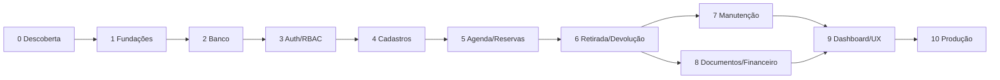

# 6. Plano de implementação por blocos

## Regra de execução

Cada bloco termina em um **STOP & REVIEW**. O bloco seguinte só começa após os critérios de aceite passarem e as decisões pendentes serem registradas. Segurança básica começa nas fundações; hardening e pentest aprofundam a proteção depois.

## Bloco 0 — Descoberta e decisões de negócio

### Escopo

- Validar tipos de carreta, regras de preço e aluguel por hora/dia.
- Definir política de reserva, cancelamento, atraso, caução e avaria.
- Definir documentos exigidos e validade mínima da CNH.
- Confirmar papéis e responsáveis internos.
- Decidir hospedagem, armazenamento de fotos e necessidade de migração do Supabase.
- Fechar escopo do MVP e backlog posterior.

### STOP & REVIEW 0

- Regras de preço e transições de status aprovadas.
- Matriz de permissões aprovada.
- Campos obrigatórios e retenção de dados definidos.
- Nenhuma dúvida que altere modelagem permanece aberta.

## Bloco 1 — Fundações e ambiente

### Escopo

- Criar monorepo `backend`, `frontend`, `infra`, `docs`.
- Docker Compose com API e PostgreSQL.
- FastAPI com `/health`, configuração e tratamento padrão de erros.
- React/Vite/TypeScript/Tailwind com layout e roteamento base.
- Qualidade: lint, formatação, testes mínimos e `.env.example`.
- Pipeline inicial de integração contínua.

### STOP & REVIEW 1

- Ambiente sobe de forma reproduzível.
- API, documentação OpenAPI e frontend abrem sem erro.
- Nenhum segredo está versionado.
- Checks básicos executam no pipeline.

## Bloco 2 — Banco, migrations e dados de desenvolvimento

### Escopo

- Modelar usuários, sessões, clientes, carretas, locações, vistorias, fotos, manutenção e históricos.
- Criar migration inicial e índices.
- Implementar constraints e estratégia de inativação.
- Criar seed somente com dados fictícios.
- Preparar plano/script futuro de migração dos quatro conjuntos do Supabase.

### STOP & REVIEW 2

- Banco nasce do zero por migrations.
- Relacionamentos e restrições impedem estados inválidos básicos.
- Seed é idempotente em desenvolvimento.
- Diagrama e dicionário de dados refletem o schema.

## Bloco 3 — Autenticação, usuários e RBAC

### Escopo

- Login, refresh rotativo, logout e usuário atual.
- Argon2id, cookies seguros e revogação.
- Gestão administrativa de usuários.
- Dependências de autorização no backend.
- Rotas protegidas e sessão no frontend.
- Testes da matriz de permissões.

### STOP & REVIEW 3

- Usuários acessam apenas recursos permitidos.
- Refresh token não aparece no armazenamento JavaScript.
- Rate limit e revogação funcionam.
- Tentativas de IDOR retornam negação adequada.

## Bloco 4 — Cadastros de clientes e carretas

### Escopo

- CRUD com paginação, busca e inativação.
- CPF, idade, CNH, CEP e campos de endereço.
- Cadastro técnico e tarifas da carreta.
- Histórico e validações de registros vinculados.
- Interfaces responsivas e acessíveis.

### STOP & REVIEW 4

- Duplicidades são rejeitadas com mensagem clara.
- Registros com histórico não são apagados indevidamente.
- Máscaras não substituem validação real.
- Perfis sem permissão não alteram cadastros.

## Bloco 5 — Agenda, preço e reservas

### Escopo

- Consulta de disponibilidade por intervalo.
- Endpoint oficial de cotação.
- Criação de rascunho/reserva em transação.
- Snapshot de preço e desconto autorizado.
- Detecção de conflitos concorrentes.
- Assistente de nova locação adaptado do fluxo original.

### STOP & REVIEW 5

- Duas solicitações concorrentes não reservam a mesma carreta.
- Manipular preço no navegador não altera valor oficial.
- Alterar tarifa futura não modifica locações existentes.
- Agenda representa reservas, locações e manutenção.

## Bloco 6 — Retirada, devolução e vistorias

### Escopo

- Checklist e fotos de retirada.
- Ativação da locação.
- Vistoria de devolução, atraso e avarias.
- Finalização e liberação/bloqueio da carreta.
- Histórico completo de transições.
- Experiência mobile para uso no pátio.

### STOP & REVIEW 6

- Locação não ativa sem requisitos de retirada.
- Devolução registra hora real e estado da carreta.
- Fotos privadas abrem somente para usuários autorizados.
- Falha intermediária não deixa locação e carreta em estados divergentes.

## Bloco 7 — Manutenção e disponibilidade operacional

### Escopo

- Ordens de manutenção e custos.
- Bloqueio automático por período.
- Encaminhamento para manutenção após avaria.
- Alertas e dashboard operacional.

### STOP & REVIEW 7

- Manutenção conflita corretamente com reservas.
- Concluir ordem atualiza disponibilidade de forma segura.
- Histórico técnico permanece auditável.

## Bloco 8 — Documentos e financeiro básico

### Escopo

- Geração de contrato, termos de vistoria e recibo.
- Cobranças de aluguel, atraso, desconto, limpeza e avaria.
- Registro manual de pagamento no MVP, se aprovado.
- Preparação para gateway sem acoplá-lo ao domínio.
- Jobs assíncronos caso a geração/envio exceda o tempo aceitável.

### STOP & REVIEW 8

- Documentos usam snapshots históricos corretos.
- Valores do documento batem com o banco.
- Reprocessar documento/job não duplica cobrança.
- Acesso financeiro respeita RBAC.

## Bloco 9 — Dashboard, relatórios e UX final

### Escopo

- Indicadores operacionais e financeiros autorizados.
- Filtros, exportações e relatórios.
- Estados de loading, vazio e erro.
- Responsividade, teclado, contraste e alvos de toque.
- Revisão do fluxo completo com usuários reais.

### STOP & REVIEW 9

- Indicadores reconciliam com consultas do banco.
- Exportações protegem dados pessoais.
- Fluxos críticos funcionam em desktop e celular.
- Aceite operacional formal registrado.

## Bloco 10 — Migração, hardening e produção

### Escopo

- Ensaio de migração dos dados existentes.
- Testes de carga básicos e otimização de índices.
- Revisão de dependências, headers, CORS, uploads e segredos.
- Backup, restauração, alertas e runbooks.
- Pentest e correções.
- Deploy em homologação, aceite e produção.

### STOP & REVIEW 10 — Entrega

- Migração reconciliada por contagens e valores.
- Backup foi restaurado em ambiente isolado.
- Vulnerabilidades críticas/altas resolvidas.
- Monitoramento e rollback testados.
- Operação conhece suporte, contingência e recuperação.

## Dependências entre blocos

## Backlog posterior ao MVP

- Assinatura eletrônica e validade jurídica definida.
- Gateway de pagamento e conciliação.
- WhatsApp/e-mail com consentimento e templates.
- Portal do cliente.
- Multiunidade.
- PWA offline para vistorias.
- Integração fiscal/contábil.

